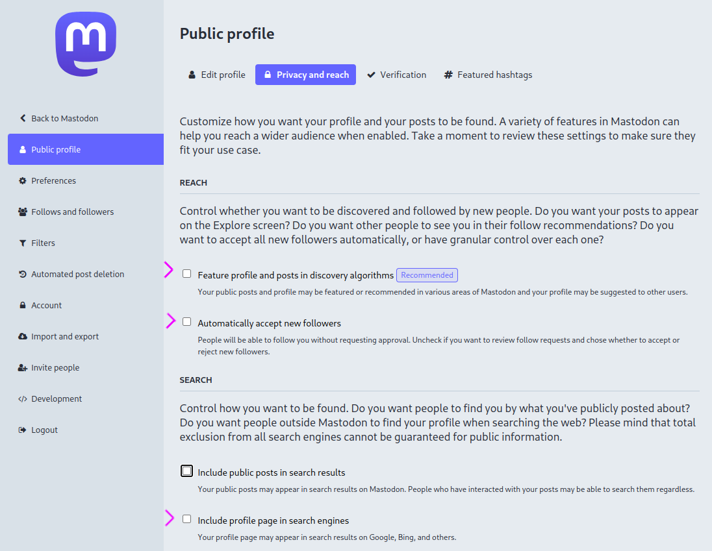

* Awakari is automatically processing, sharing and temporarily storing a **public** data from various **public** sources.
* Awakari is doing the best effort to avoid the processing of a personal data or a data under a copyright.
* Awakari is free to use and doesn't "sell" a data.
* Awakari always specifies the content original source.

# Opt-Out Methods

The opt-out method depends on the source type. Each method is described below.

## Public Web Feed (RSS/Atom/...)

Use [robots.txt](https://en.wikipedia.org/wiki/Robots.txt) to restrict Awakari from processing the feed.

## Fediverse

Put the `#nobot` tag in:
1. Actor's [summary](https://www.w3.org/TR/activitystreams-vocabulary/#dfn-summary) to avoid following the specific actor.
2. Activity object's [content](https://www.w3.org/TR/activitystreams-vocabulary/#dfn-content) to avoid processing the specific activity (e.g. post).

Note that the `#nobot` tag should be separated by whitespaces from another text, if any. 

### Mastodon

Mastodon users have additional configuration options to avoid a processing by Awakari:

1. Disable the *Feature profile and posts in discovery algorithms* checkbox
2. Disable the *Automatically accept new followers* checkbox
3. Disable the *Include profile page in search engines* checkbox

## Telegram Channel

Put the `#nobot` tag in:
1. Channel info to avoid Awakari listening the channel public posts.
2. Post text to avoid Awakari processing the specific public channel post.

Note that the `#nobot` tag should be separated by whitespaces from another text, if any.
