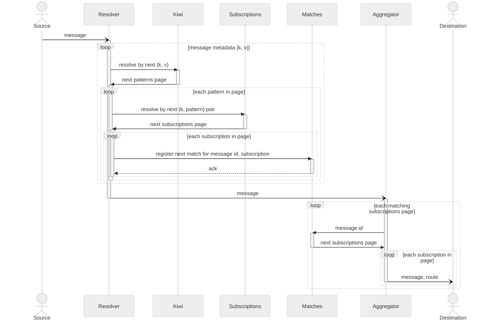

# Scalable wildcard message routing

<table>
    <thead>
        <tr>
            <td></td>
            <td colspan="5" align="center"><b>Solution</b></td>
        </tr>
        <tr>
            <td rowspan="2"></td>
            <td rowspan="2" align="center"><b>Redis</b></td>
            <td rowspan="2" align="center"><b>Nats</b></td>
            <td rowspan="2" align="center"><b>Kafka</b></td>
            <td colspan="2" align="center"><b>Awakari</b></td>
        </tr>
        <tr>
            <td>kiwi-tree</td>
            <td>kiwi-bird</td>
        </tr>
    </thead>
    <tbody>
        <tr>
            <td><b>Pattern Syntax</b></td>
            <td> Limited</td>
            <td> Limited</td>
            <td> Full</td>
            <td> Limited</td>
            <td></img> Full</td>
        </tr>
        <tr>
            <td><b>Matching Time</b> (N subscriptions)</td>
            <td> O(N)</td>
            <td> O(N)</td>
            <td> O(N)</td>
            <td> O(log(N))</td>
            <td> O(N)</td>
        </tr>
        <tr>
            <td><b>Horizontal Scalability</b></td>
            <td></td>
            <td></td>
            <td> Consumer matches</td>
            <td></td>
            <td></td>
        </tr>
        <tr>
            <td><b>Matching Criteria</b></td>
            <td>Channel only</td>
            <td>Subject only</td>
            <td>Topic only</td>
            <td colspan="2">Any metadata (key-value)</td>
        </tr>
    </tbody>
</table>

| Solution                          | Redis                                       | Nats                                        | Kafka                                        | Awakari kiwi-tree                        | Awakari kiwi-bird                       |
|-----------------------------------|---------------------------------------------|---------------------------------------------|----------------------------------------------|---------------------------------------------|---------------------------------------------|
| Subscription Pattern Syntax       | Limited      | Limited      | Full        | Limited      | Full       |
| Matching time for N subscriptions | O(N)         | O(N)         | O(N)          | O(log(N))  | O(N)         |
| Matching side                     | Broker     | Broker     | Consumer      | Broker     | Broker     |
| Scalability                       | Horizontal | Horizontal | Vertical only | Horizontal | Horizontal |

Existing messaging solutions offer wildcard subscriptions:
* [Redis](https://redis.io/commands/psubscribe/)
* [NATS](https://docs.nats.io/nats-concepts/subjects#wildcards)
* [Kafka](https://kafka.apache.org/32/javadoc/org/apache/kafka/clients/consumer/KafkaConsumer.html#subscribe(java.util.regex.Pattern,org.apache.kafka.clients.consumer.ConsumerRebalanceListener))

These solutions are able to resolve subscriptions in O(N) time, where N is the number of wildcard subscriptions.
This is not efficient because the time to resolve such subscriptions will grow with increasing number of subscriptions.
Awakari offers a more scalable solution for this.

Nevertheless, Awakari is not a messaging delivery system but a primitive.
The purpose is only to resolve subscriptions by an input message.
So it should be used as a component of a more sophisticated system.
For example, it can be used as a part of the system working ahead of Redis/NATS/Kafka to solve their scalability issues.

The heart of Awakari is [Kiwi](https://github.com/awakari/kiwi) providing the wildcards search by a sample in a O(log N)
time. 

