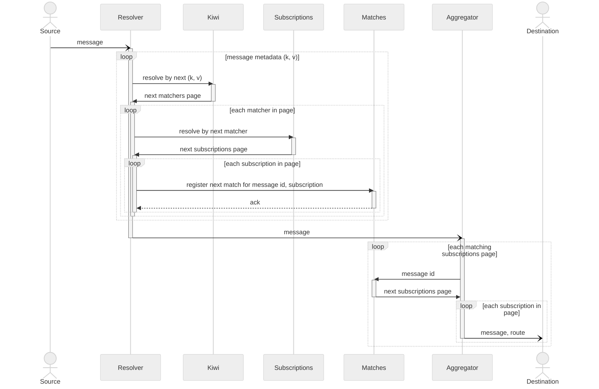

# Scalable wildcard message routing

```mermaid
%%{init: {'theme': 'neutral' } }%%
sequenceDiagram

    actor Source
    participant Resolver
    participant Kiwi
    participant Subscriptions
    participant Matches
    participant Aggregator
    actor Destination

    Source-)Resolver: message
    activate Resolver
    
    loop message metadata (k, v)
    
        Resolver->>Kiwi: resolve by next (k, v)
        activate Kiwi
        Kiwi->>Resolver: next matchers page
        deactivate Kiwi
        
        activate Resolver
        loop each matcher in page
            
            Resolver->>Subscriptions: resolve by next matcher
            activate Subscriptions
            Subscriptions->>Resolver: next subscriptions page
            deactivate Subscriptions
            
            activate Resolver
            loop each subscription in page
                Resolver->>Matches: register next match for message id, subscription
                activate Matches
                Matches-->>Resolver: ack
                deactivate Matches
            end
            deactivate Resolver
            
        end
        deactivate Resolver
    end
        
    Resolver-)Aggregator: message
    deactivate Resolver

    activate Aggregator
    loop each matching subscriptions page
        
        Aggregator->>Matches: message id
        activate Matches
        Matches->>Aggregator: next subscriptions page
        deactivate Matches
        
        loop each subscription in page
            Aggregator-)Destination: message, route
            deactivate Aggregator
        end
        
    end
```