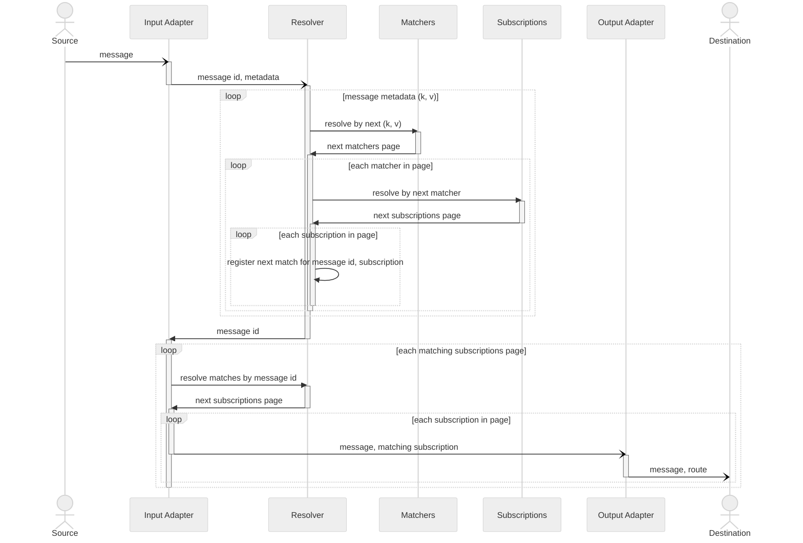

# Scalable Wildcard Subscriptions

Resolution sequence diagram:

The above diagram is simplified, it hides:
1. message metadata values segmentation and matches against every lexeme
2. 4 different matchers services - includes/excludes x complete/partial

