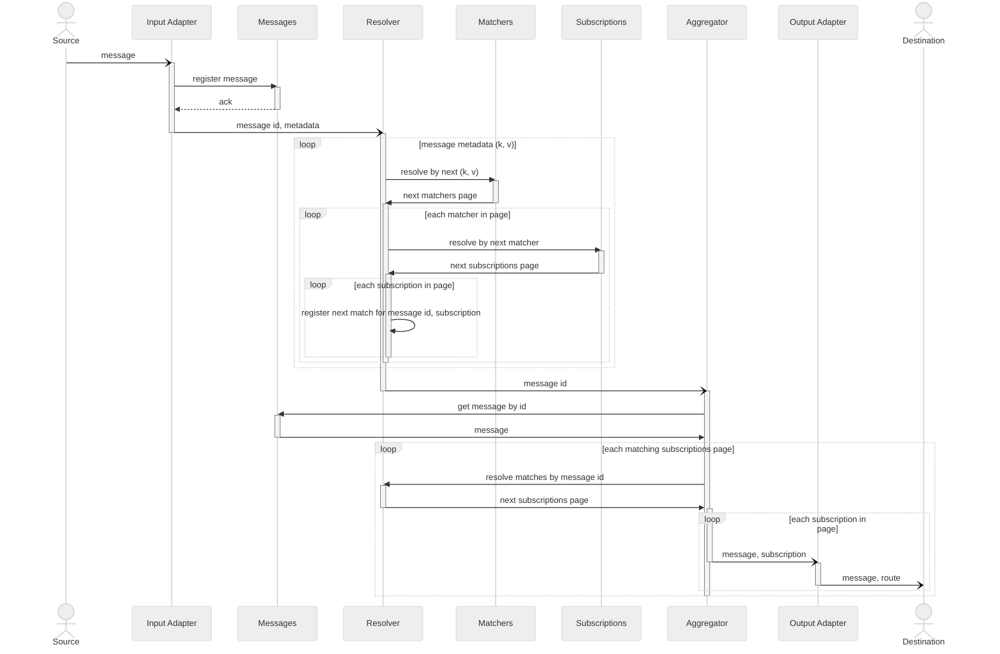

# Scalable Wildcard Subscriptions

```mermaid
%%{init: {'theme': 'neutral' } }%%
sequenceDiagram

    actor Source
    participant Input Adapter
    participant Messages
    participant Resolver
    participant Matchers
    participant Subscriptions
    participant Aggregator
    participant Output Adapter
    actor Destination

    Source-)Input Adapter: message
    activate Input Adapter
    
    Input Adapter->>Messages: register message
    activate Messages
    Messages-->>Input Adapter: ack
    deactivate Messages
    
    Input Adapter-)Resolver: message id, metadata
    deactivate Input Adapter
    activate Resolver
    
    loop message metadata (k, v)
    
        Resolver->>Matchers: resolve by next (k, v)
        activate Matchers
        Matchers->>Resolver: next matchers page
        deactivate Matchers
        
        activate Resolver
        loop each matcher in page
            
            Resolver->>Subscriptions: resolve by next matcher
            activate Subscriptions
            Subscriptions->>Resolver: next subscriptions page
            deactivate Subscriptions
            
            activate Resolver
            loop each subscription in page
                Resolver->>Resolver: register next match for message id, subscription
            end
            deactivate Resolver
            
        end
        deactivate Resolver
    end
    
    Resolver-)Aggregator: message id
    deactivate Resolver

    activate Aggregator
    
    Aggregator->>Messages: get message by id
    activate Messages
    Messages->>Aggregator: message
    deactivate Messages
    
    loop each matching subscriptions page
        
        Aggregator->>Resolver: resolve matches by message id
        activate Resolver
        Resolver->>Aggregator: next subscriptions page
        deactivate Resolver
        
        activate Aggregator
        loop each subscription in page
            Aggregator-)Output Adapter: message, subscription
            deactivate Aggregator
            activate Output Adapter
            Output Adapter-)Destination: message, route
            deactivate Output Adapter
        end
        
    end
    deactivate Aggregator
```