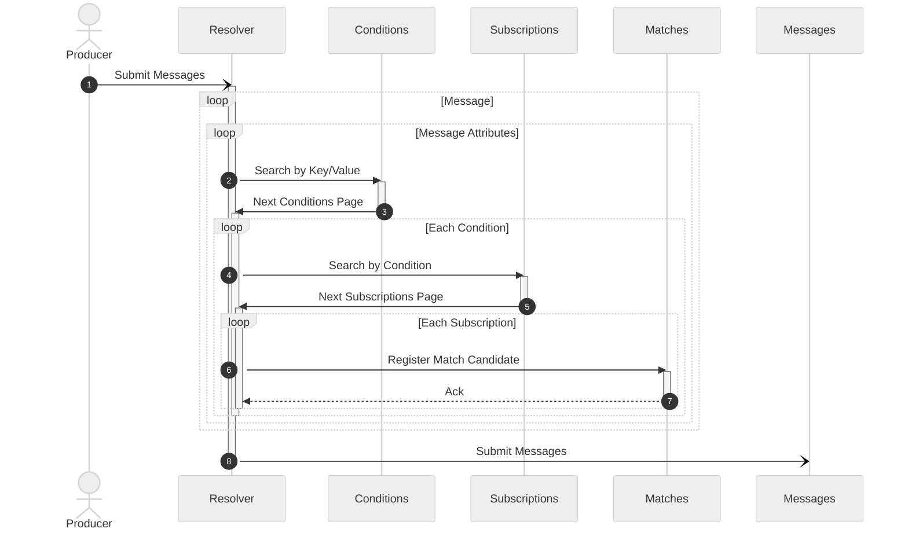
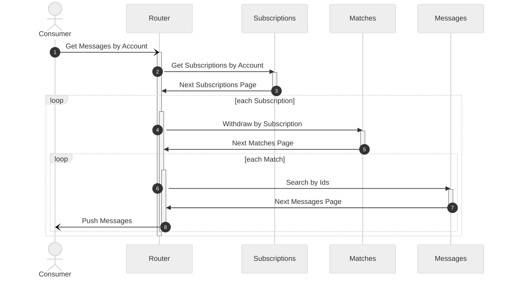

# Contents

1. [Overview](#1-overview) 
   1.1. [Comparison](#11-comparison) 
   1.2. [Purpose](#12-purpose) 
   1.3. [Definitions](#13-definitions) 
2. [Deployment](#2-deployment) 
3. [Usage](#3-usage) 
4. [Configuration](#4-configuration) 
5. [Design](#5-design) 
6. [Additional Infromation](#6-additional-information) 

# 1. Overview

Conventional search engines are used to find information by a query. 
The problem is reverse in the modern world of real-time data streams.
It's necessary to filter and consume the data matching a query on the fly.
Existing stream processing solutions offer only the iteration way to find matching queries.
For example, a system may have billions of user queries registered.
Then every incoming message causes the iteration over the billions queries to find all the matches.
So this doesn't scale efficiently when number of queries grows.

Awakari is a message pub/sub system that comes to solve this problem.
It brings additional features:
* Rich subscription matching conditions: 
  * Wildcards
  * Grouping:
    * Nested conditions and groups 
    * Logic functions
* Scalability:
  * Handle any big number of subscriptions
  * Sustain any large message throughput without a latency impact

## 1.1. Comparison

Awakari may be used together with another reliable message queue system and inherit the persistence and delivery 
guarantee. The key differences from other message pub/sub solutions are:
<table>
    <thead>
        <tr>
            <td rowspan="2" colspan="2"><b>Criteria</b></td>
            <td colspan="4" align="center"><b>Solution</b></td>
        </tr>
        <tr>
            <td align="center" valign="top"><b>Awakari</b></td>
            <td align="center" valign="top"><b>Kafka</b></td>
            <td align="center" valign="top"><b>Nats (JetStream)</b></td>
        </tr>
    </thead>
    <tbody>
        <tr>
            <td rowspan="2">Wildcard Subscriptions</td>
            <td>Horizontal Scalability</td>
            <td align="center"></td>
            <td align="center"></td>
            <td align="center"></td>
        </tr>
        <tr>
            <td>Matching Time Complexity</td>
            <td align="center"></td>
            <td align="center"></td>
            <td align="center"></td>
        </tr>
        <tr>
            <td rowspan="2">Matching Criteria</td> 
            <td>Attributes</td>
            <td align="center"></td>
            <td align="center"></td>
            <td align="center"></td>
        </tr>
        <tr>
            <td>Grouping and Logic</td>
            <td align="center"></td>
            <td align="center"></td>
            <td align="center"></td>
        </tr>
    </tbody>
</table>

## 1.2. Purpose

TODO

## 1.3. Definitions

TODO

# 2. Deployment

TODO

# 3. Usage

TODO

# 4. Configuration

TODO

# 5. Design

The core of Awakari consist of: 
* Storage Services
  * Conditions
  * Subscriptions
  * Matches
* Stateless Processing Pipeline
  * Resolver
  * Router
* Queue Service

Additionally, there's:
* Source message producer
* Routed message consumer
* UI

Producer flow: 

Consumer flow:

# 6. Additional Information

* [Roadmap](ROADMAP.md)
* [Contributing](CONTRIBUTING.md)
